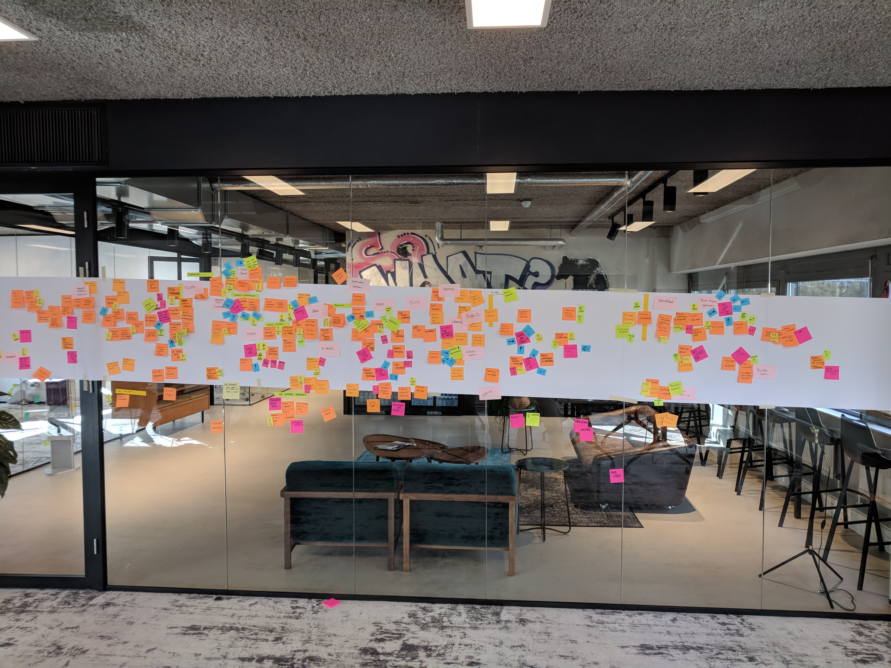
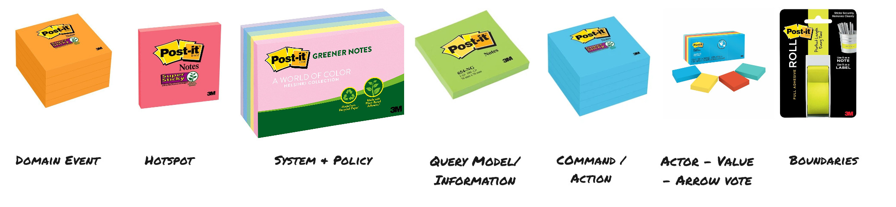
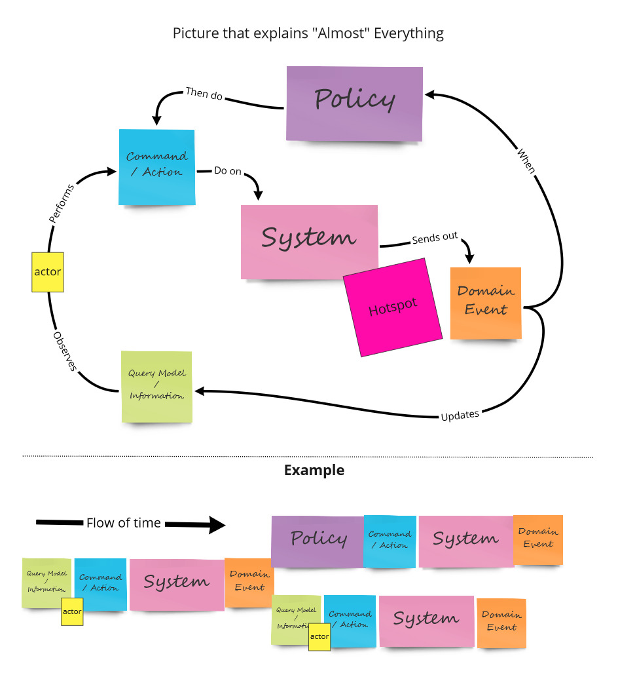
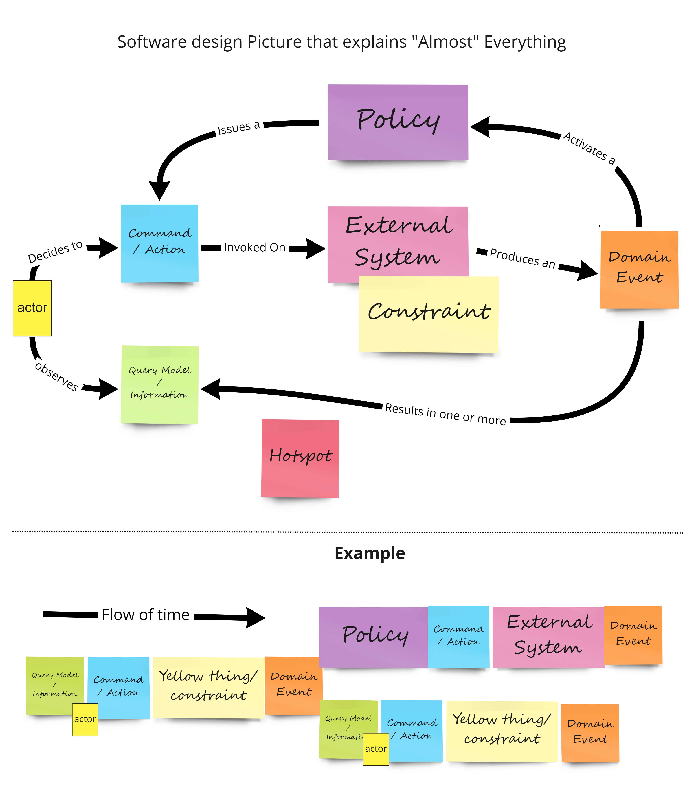
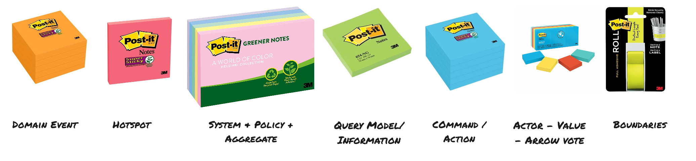

# EventStorming Glossary & Cheat sheet

EventStorming is the smartest approach to collaborate beyond silo boundaries. The power of EventStorming comes from a diverse multi-disciplined group of people who, together, have a lot of wisdom and knowledge. While it originally was invented for a workshop to model domain-driven design aggregates, it now has a broader spectrum. From gaining a big-picture problem space of the whole domain to gaining insight into the entire software delivery flow and creating a long term planning. Every one of these workshops has the same basic requirements and needs. 

Here you will find a combination of a glossary of terms on EventStorming core concepts written down in a consistent and comprehensive glossary. Just be sure to try and avoid jargon as much as possible, as it sets up the unnecessary insider-outsider distinction. And a Cheat sheet that you can use facilitating your own EventStorming.

## Glossary

### Core Concepts

**Domain Event**
A Domain Event is the main concept of EventStorming. It is an event that is relevant for the domain experts and contextual for the domain that is being explored. A Domain Event is a verb at the past tense. The official EventStorming colour is orange.

**HotSpot**
Hotspots are used to visualise and capture hot conflicts. Conflicts caused by, and not exclusive to, inconsistencies (in language), frictions, questions, dissent, objections, issues or procrastinating going deep to explore for later. The official EventStorming colour is neon pink and we also slighly pivot a hotspot when we use it.

**Timeline**
EventStorming is a powerfull tool when we have a story to tell, when we have a timeline. The paper roll on the wall represents time from left to right. We can have parallel streams from top to bottom on the paper roll.

**Chaotic Exploration**  
Chaotic exploration can be used at the start of EventStorming. Each person writes Domain Events by themselves that they can think off. They will put these Domain Events in order they think they happen on the paper roll.

**Enforce the Timeline**  
A phase happening after chaotic exploration, meaning we try to make the timeline consistent and remove duplicate stickies.

### Big Picture EventStorming

The goal of Big Picture EventStorming is to assess the health of an existing line of business or explore the viability of a new startup business model. It helps the group create a shared state of mind of the vision of that domain of the company. We can use the output as input for Conway’s law alignment, organising business flow around teams and software with emergent bounded contexts. You can do these workshop with 10-30+ people on one paper roll.

**Opportunity**  
Because a Hotspot can have a negative association we also give people the chance to add opportunities. We use green because of the accosiation it has with something positive. Start using Opportunities after we made a consistent timeline.

**Actor/Agent**  
Actor or Agent is a group of people, a department, a team or a specific person involved around a (group of) Domain Event(s). The official colour to use is a small yellow post-it.

**System**  
A system is a deployable IT System used as a solution for a problem in the domain. When we finished making the timeline consistent we can start mapping systems around Domain Events. There can also be duplicates and it can be anything from using Excell to some microservice. The official colour is a wide pink post-it.

**Value**  
We can add value like we would do in a value stream map once we made the timeline consistent. We do this to make explicit where the value is in our domain. We use the red and green small stickies to show positive and negative value.

**Pivotal Events**  
With Pivotal Events, we start looking for the few most significant events in the flow. For an e-commerce website, they might look like “Article Added to Catalogue”, “Order Placed”, “Order Shipped”, “Payment Received” and “Order Delivered”. These are often the events with the highest number of people interested. 

*Source: https://leanpub.com/ddd_first_15_years – Discovering Bounded Contexts with EventStorming — Alberto Brandolini*

**Swimlanes**   
Separating the whole flow into horizontal swimlanes, assigned to given actors or departments, is another tempting option since it improves readability. This seems the most obvious choice for people with a background in process modelling.

*Source: https://leanpub.com/ddd_first_15_years – Discovering Bounded Contexts with EventStorming — Alberto Brandolini*

**Emerging Bounded Context**  
From a Big Picture EventStorming we can picture Emerging Bounded Context. They are the first indicators of were to start deep-diving towards designing bounded context around business problems.

*Source: https://leanpub.com/ddd_first_15_years – Discovering Bounded Contexts with EventStorming — Alberto Brandolini*

### Process modelling EventStorming

The goal of process modelling EventStorming is to assess the health of a current process in the company. It helps the group create a shared state of mind of the current status quo of the process, finding bottlenecks and find parts of the system to decouple the existing software.

*Source: https://leanpub.com/introducing_eventstorming*

**Policy**  
In essence, a policy is a reaction that says “whenever X happens, we do Y”. Eventually ending up with in the flow between a Domain Event and a Command/action. We use a big lilac post-it for these. A policy can be an automated process or manual. A policy can also be named a reactor, eventual business constraint or rule or a lie detector because there is always more to policies than you first think.

**Command/Action**  
Represents decisions, actions or intent. They can be initiated by an actor or from an automated process. During process EventStorming usually, the word Action first better with stakeholders than command. We officially use a blue coloured post-it for it.

**Query Model/Information**  
To make decisions an actor might need information, we capture these in a Query Model. For process EventStorming information might be more recognised by stakeholders. We officially use a green post-it to represent a query model.

**Enforce colour coding**  
Enforcing the colour coding is playing EventStorming by the rules. Often used after or during enforcing the timeline it creates a different dynamic. Below you see the colour coding and how they are to be used in the flow of the timeline. 

### Software Design EventStorming

The outcome of a design level EventStorming is to design clean and maintainable Event-Driven software, to support rapidly evolving businesses. Together with business stakeholders, we design a shared language and represent that in a shared model that brings value in solving a problem within a bounded context.

**Aggregate/Consistent Business Rule**  
An aggregate is a Domain-Driven Design pattern that represents cluster of domain objects to make invalid state unrepresentable. We use the big yellow post-it to represent it. Because we want to avoid using the DDD jargon with our stakeholder, we can also use consistent business rule or constraint instead. 

## Cheat Sheet

TBD

## Sources

* [EventStorming.com](https://EventStorming.com)
* [Leanpub: Introducing EventStorming](https://leanpub.com/introducing_eventstorming)
* [Leanpub: DDD First 15 years](https://leanpub.com/ddd_first_15_years) – Discovering Bounded Contexts with EventStorming — Alberto Brandolini  
* [Alberto Brandolini](https://twitter.com/ziobrando)  

## Contributors

Thanks to all [existing and future contributors](https://github.com/ddd-crew/eventstorming-glossary-cheat-sheet/graphs/contributors) and to the following individuals who have all contributed to the EventStorming Glossary and Cheat sheet:

- [Kenny Baas-Schwegler](https://github.com/baasie)

## Contributions and Feedback

The EventStorming Glossary and Cheat sheet is freely available for you to use. In addition, your feedback and ideas are welcome to improve the technique or to create alternative versions.

If you have questions you can ping us or open an [Issue](https://github.com/ddd-crew/eventstorming-glossary-cheat-sheet/issues/new/choose).

Feel free to also send us a pull request with your examples or experience reports.

[![CC BY 4.0][cc-by-shield]][cc-by]

This work is licensed under a [Creative Commons Attribution 4.0 International
License][cc-by].

[![CC BY 4.0][cc-by-image]][cc-by]

[cc-by]: http://creativecommons.org/licenses/by/4.0/
[cc-by-image]: https://i.creativecommons.org/l/by/4.0/88x31.png
[cc-by-shield]: https://img.shields.io/badge/License-CC%20BY%204.0-lightgrey.svg