# Glossário e guia de referência rápida do EventStorming

> **Nota sobre os recursos visuais e as fontes:** as imagens e os diagramas reutilizados nesta tradução permanecem em inglês. Na primeira ocorrência de um conceito ou rótulo visual relevante, o termo original é apresentado entre parênteses para facilitar sua identificação. Todos os créditos e links das fontes originais, incluindo os materiais atribuídos a Alberto Brandolini, foram preservados.

EventStorming é uma abordagem poderosa para colaborar além das fronteiras criadas pelos silos organizacionais. Sua força vem de um grupo diverso e multidisciplinar de pessoas que, em conjunto, reúne muito conhecimento e experiência. Embora tenha sido criado originalmente como um workshop para modelar agregados de Domain-Driven Design, hoje possui um espectro mais amplo: pode ser usado para compreender o panorama geral do espaço de problemas de um domínio, obter visibilidade sobre todo o fluxo de entrega de software e apoiar planejamentos de longo prazo. Todos esses formatos de workshop compartilham alguns requisitos e necessidades fundamentais.

Este documento combina um glossário consistente e abrangente dos principais conceitos de EventStorming com um guia de referência rápida para facilitar seus próprios workshops. Procure evitar jargões sempre que possível, pois eles podem criar uma separação desnecessária entre quem pertence e quem não pertence ao grupo.

## Glossário

### Conceitos fundamentais (*Core Concepts*)

**Evento de Domínio (*Domain Event*)**  
O Evento de Domínio é o conceito central do EventStorming. Trata-se de um acontecimento relevante para os especialistas do domínio e contextualizado no domínio que está sendo explorado. Um Evento de Domínio é escrito como um verbo no passado. A cor oficial no EventStorming é laranja.

**Ponto de atenção (*HotSpot*)**  
Os pontos de atenção são usados para visualizar e registrar conflitos relevantes. Eles podem representar, entre outras situações, inconsistências — inclusive de linguagem —, atritos, perguntas, divergências, objeções, problemas ou temas cujo aprofundamento foi adiado. A cor oficial no EventStorming é rosa-neon, e o post-it costuma ser posicionado levemente inclinado.

**Linha do tempo (*Timeline*)**  
EventStorming é especialmente poderoso quando existe uma história para contar e, portanto, uma linha do tempo. O rolo de papel na parede representa a passagem do tempo da esquerda para a direita. Fluxos paralelos podem ser dispostos de cima para baixo.

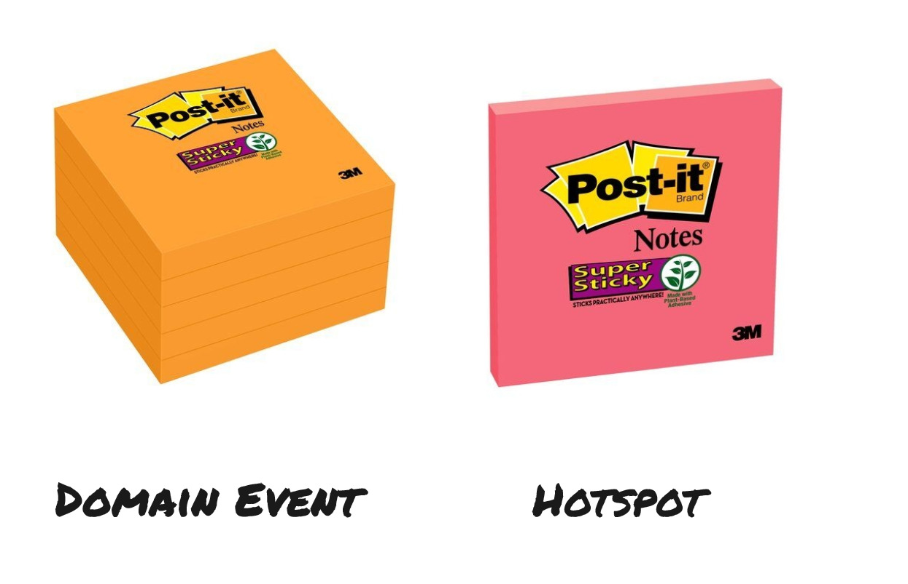

**Exploração caótica (*Chaotic Exploration*)**  
A exploração caótica pode ser usada no início de um EventStorming. Cada participante escreve individualmente todos os Eventos de Domínio dos quais consegue se lembrar e os posiciona no rolo de papel na ordem em que acredita que ocorram.

**Consolidar a linha do tempo (*Enforce the Timeline*)**  
É a etapa posterior à exploração caótica, na qual o grupo busca tornar a linha do tempo consistente e remover post-its duplicados.

### Big Picture EventStorming

O objetivo do **Big Picture EventStorming** é avaliar a saúde de uma linha de negócio existente ou explorar a viabilidade do modelo de negócio de uma nova startup. O workshop ajuda o grupo a construir uma compreensão compartilhada da visão daquele domínio da empresa. Seu resultado pode servir de entrada para o alinhamento relacionado à Lei de Conway, organizando o fluxo de negócio em torno de times e software com contextos delimitados emergentes. Esse formato pode ser realizado com 10, 30 ou mais pessoas trabalhando em um único rolo de papel.

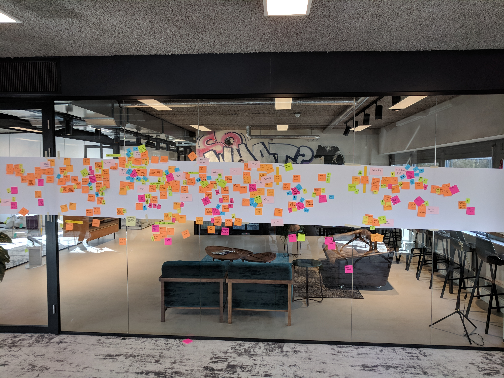

**Oportunidade (*Opportunity*)**  
Como um ponto de atenção pode carregar uma associação negativa, também oferecemos aos participantes a possibilidade de registrar oportunidades. Utilizamos a cor verde por sua associação com algo positivo. As oportunidades devem começar a ser adicionadas depois que a linha do tempo estiver consistente.

**Ator/Agente (*Actor/Agent*)**  
Um ator ou agente pode ser um grupo de pessoas, um departamento, um time ou uma pessoa específica envolvida em um Evento de Domínio ou em um conjunto de eventos. A representação oficial é um post-it amarelo pequeno.

**Sistema (*System*)**  
Um sistema é um sistema de TI implantável utilizado como solução para um problema do domínio. Depois que a linha do tempo estiver consistente, os sistemas podem ser mapeados ao redor dos Eventos de Domínio. Podem existir duplicidades, e um sistema pode variar desde uma planilha do Excel até um microsserviço. A representação oficial é um post-it rosa largo.

**Valor (*Value*)**  
Após consolidar a linha do tempo, podemos adicionar valor de maneira semelhante ao que fazemos em um mapa de fluxo de valor. O objetivo é explicitar onde o valor está presente no domínio. Post-its pequenos verdes e vermelhos representam, respectivamente, valor positivo e negativo.

**Eventos centrais (*Pivotal Events*)**  
Os Eventos centrais ajudam a identificar os poucos acontecimentos mais significativos do fluxo. Em um comércio eletrônico, eles poderiam ser “Artigo adicionado ao catálogo”, “Pedido realizado”, “Pedido enviado”, “Pagamento recebido” e “Pedido entregue”. Normalmente, são os eventos que despertam o interesse do maior número de pessoas.

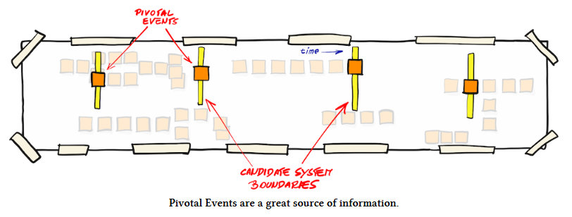
*Fonte: https://leanpub.com/ddd_first_15_years — Discovering Bounded Contexts with EventStorming — Alberto Brandolini*

**Raias (*Swimlanes*)**  
Separar o fluxo completo em raias horizontais atribuídas a determinados atores ou departamentos é uma opção atraente porque melhora a legibilidade. Essa costuma ser a escolha mais intuitiva para pessoas com experiência em modelagem de processos.

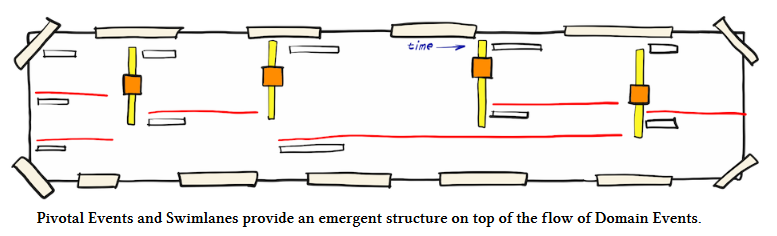
*Fonte: https://leanpub.com/ddd_first_15_years — Discovering Bounded Contexts with EventStorming — Alberto Brandolini*

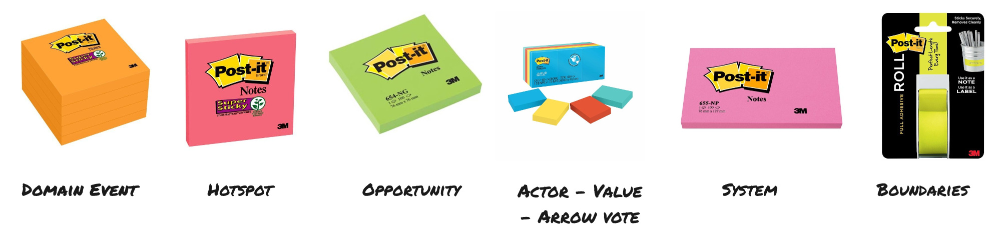

**Contextos delimitados emergentes (*Emerging Bounded Contexts*)**  
A partir de um Big Picture EventStorming, podemos visualizar contextos delimitados emergentes. Eles são os primeiros indicadores de onde iniciar um aprofundamento para projetar contextos delimitados ao redor dos problemas de negócio.

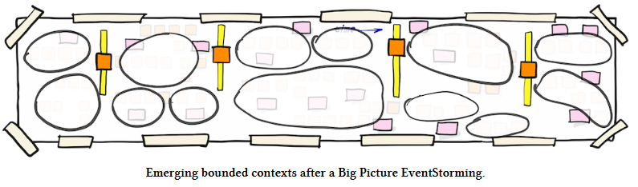
*Fonte: https://leanpub.com/ddd_first_15_years — Discovering Bounded Contexts with EventStorming — Alberto Brandolini*

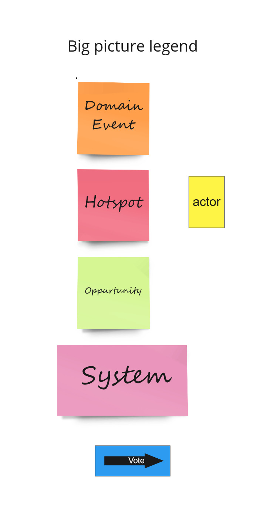

### EventStorming para modelagem de processos (*Process Modelling EventStorming*)

O objetivo do EventStorming para modelagem de processos é avaliar a saúde de um processo atual da empresa. Ele ajuda o grupo a construir uma compreensão compartilhada do estado atual do processo, encontrar gargalos e identificar partes que podem ser desacopladas do software existente.

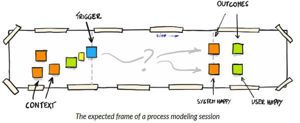
*Fonte: https://leanpub.com/introducing_eventstorming*

**Política (*Policy*)**  
Uma política é uma reação expressa como “sempre que X acontecer, fazemos Y”. No fluxo, ela normalmente aparece entre um Evento de Domínio e um comando ou ação. Utilizamos um post-it lilás grande. Uma política pode representar um processo automatizado ou manual. Ela também pode ser chamada de reator, restrição eventual de negócio, regra ou até detector de mentiras, pois quase sempre existe mais por trás de uma política do que parece inicialmente.

**Comando/Ação (*Command/Action*)**  
Representa decisões, ações ou intenções. Pode ser iniciado por um ator ou por um processo automatizado. Durante um EventStorming de processo, a palavra “ação” costuma ser mais compreensível para as partes interessadas do que “comando”. A representação oficial é um post-it azul.

**Modelo de consulta/Informação (*Query Model/Information*)**  
Para tomar uma decisão, um ator pode precisar de informações. Registramos essas informações em um Modelo de consulta. Em um EventStorming de processo, o termo “informação” pode ser mais facilmente reconhecido pelas partes interessadas. A representação oficial é um post-it verde.

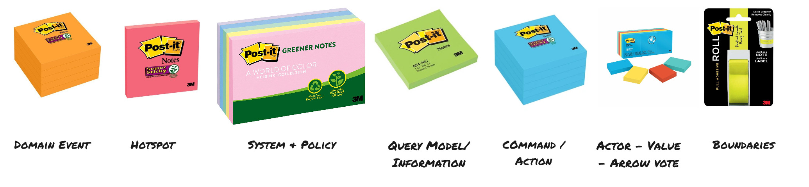

**Aplicar o código de cores (*Enforce Colour Coding*)**  
Aplicar o código de cores significa conduzir o EventStorming de acordo com suas convenções. Essa prática, geralmente adotada durante ou depois da consolidação da linha do tempo, cria uma dinâmica diferente. A imagem abaixo apresenta as cores e como elas são usadas no fluxo da linha do tempo.

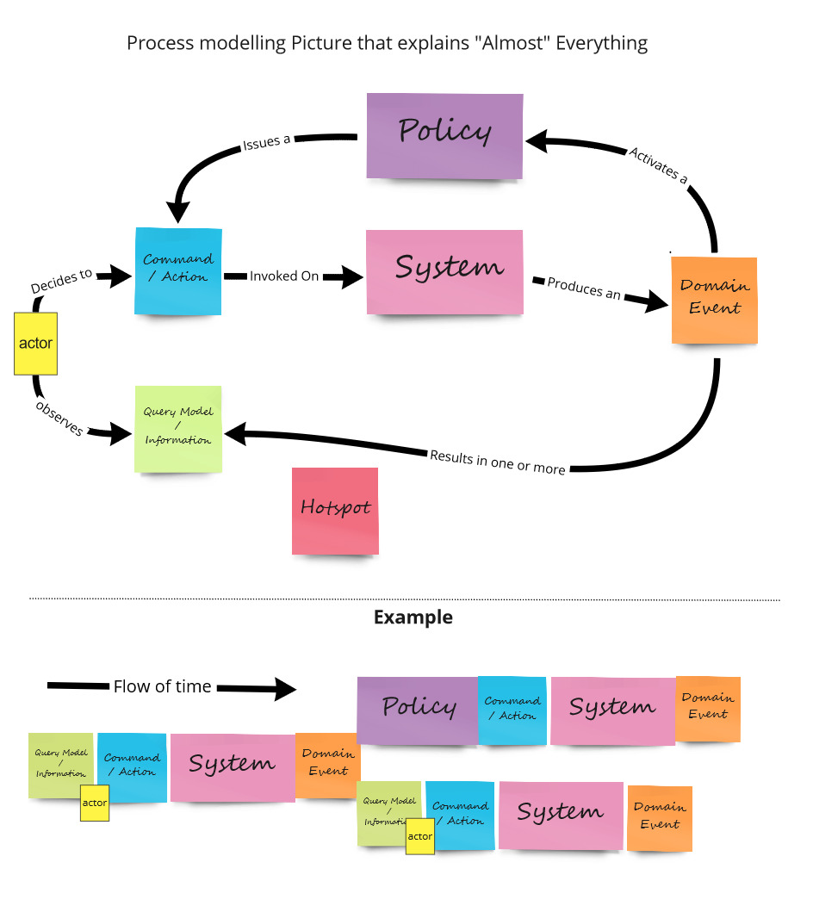

### Software Design EventStorming

O resultado de um EventStorming no nível de design é o projeto de software orientado a eventos, limpo e sustentável, capaz de apoiar negócios que evoluem rapidamente. Em conjunto com as partes interessadas do negócio, projetamos uma linguagem compartilhada e a representamos em um modelo comum que agrega valor ao resolver um problema dentro de um contexto delimitado.

**Restrição (*Constraint*)**  
Uma restrição representa uma limitação existente ou que precisa ser considerada no design do espaço de problemas ao executar um comando ou ação. Ela também pode ser entendida como uma regra ou restrição de consistência do negócio. A representação oficial é um post-it amarelo grande. Esse elemento era anteriormente chamado de agregado, termo hoje considerado legado no EventStorming, pois se prefere evitar a palavra “agregado” na colaboração com partes interessadas do negócio.

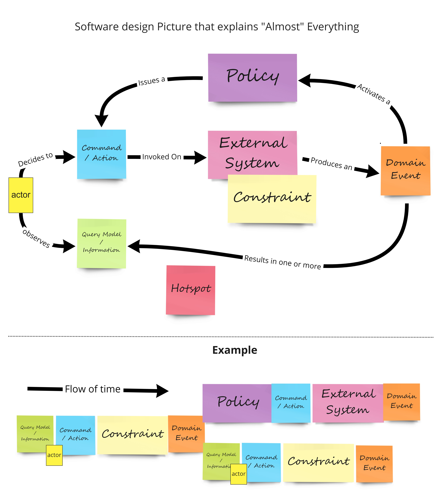
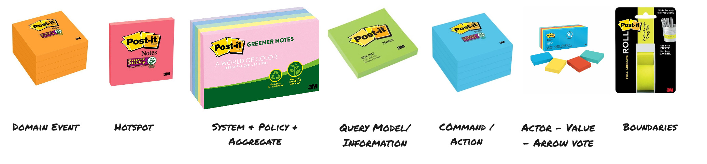

## Guia de referência rápida (*Cheat Sheet*)

### Preparação

#### Convites

Os convites são essenciais para o sucesso do workshop. Convide todas as pessoas que possuem conhecimento relevante e todas as que precisam adquirir esse conhecimento — normalmente especialistas do domínio e profissionais de engenharia. Inclua informações sobre o objetivo do workshop e sobre o que é EventStorming. O autor do material original costuma enviar aos participantes o vídeo **Alberto Brandolini — 50,000 Orange Stickies Later**, além da página de recursos do eventstorming.com.

#### Materiais

Poucas coisas são tão frustrantes quanto não ter o material correto durante o workshop. Portanto, certifique-se de que tudo o que será necessário esteja disponível. O autor do material original também menciona um artigo específico sobre esse assunto.

#### Preparação da sala (*Room Setup*)

Uma das melhores referências continua sendo a imagem do livro *EventStorming*, publicado no Leanpub. A ideia é disponibilizar uma superfície de modelagem com aproximadamente 6 a 8 metros, uma mesa para os materiais e uma legenda visível para os participantes. Evite deixar cadeiras à vista. Prefira uma sala com janelas que possam ser abertas para permitir a circulação de ar e deixe alimentos ou doces disponíveis.

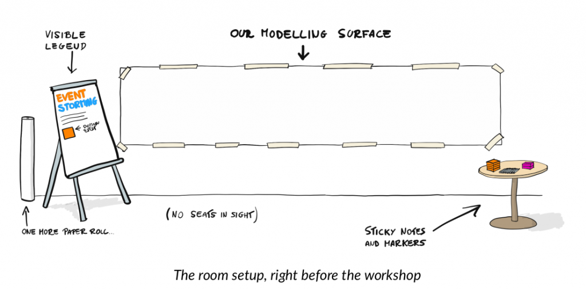
*Fonte: https://leanpub.com/introducing_eventstorming*

#### Facilitação

Um workshop de EventStorming eficaz deve contar com uma pessoa dedicada à facilitação.

Como facilitador ou facilitadora:

- mantenha uma postura neutra para encerrar discussões excessivamente longas e representá-las visualmente como pontos de atenção;
- encontre o equilíbrio entre intervir e permitir que a discussão siga seu próprio fluxo;
- seja a primeira pessoa a chegar e a última a sair, garantindo a preparação adequada da sala e criando espaço para conversar com os participantes depois do workshop;
- facilite o grupo e ofereça feedback e percepções sobre a interação para que as pessoas possam decidir como agir. Por exemplo, ao observar várias pessoas olhando para o celular, você pode dizer: “Percebo que parte do grupo está se distraindo da atividade ao olhar para o celular”;
- observe e permita que o grupo identifique suas próprias necessidades, embora às vezes seja necessário tomar uma decisão quando o próprio grupo não conseguir fazê-lo.

### Processo do workshop

#### Check-in

O workshop pode começar com um *check-in*. É importante que todos estejam presentes física e mentalmente. Pergunte aos participantes como estão, como foi o fim de semana, como estão se sentindo e o que esperam obter do encontro. Evite discutir histórias relacionadas ao trabalho ou ao próprio workshop nesse momento. O facilitador deve fazer seu check-in primeiro, dando o exemplo e compartilhando apenas o necessário. Depois, os participantes podem decidir espontaneamente a ordem em que falarão, no estilo *popcorn*. Ao final, o facilitador deve encerrar a atividade resumindo o que ouviu do grupo.

##### Acordos

Como a sala reúne pessoas com perspectivas diferentes, é fundamental estabelecer acordos sobre a colaboração durante o workshop. Registre-os explicitamente em um flip chart e fixe-o na parede, permitindo que o facilitador aponte para os acordos quando necessário. O material original propõe três acordos inspirados na **Deep Democracy**:

- todas as pessoas têm razão; ninguém possui o monopólio da verdade;
- iniciamos uma conversa para aprofundar nosso relacionamento;
- estamos dispostos a aprender juntos.

Depois, pergunte aos participantes se desejam propor outras regras e discuta com o grupo se elas devem ser adicionadas.

##### EventStorming

Em seguida, apresente uma introdução ao EventStorming. O autor do material original costuma contar uma pequena história pessoal explicando por que as formas clássicas de colaboração não funcionam para ele e por que o EventStorming é diferente. Desenvolva uma história que faça sentido para seu próprio contexto. Use a legenda para explicar os fundamentos de um Evento de Domínio.

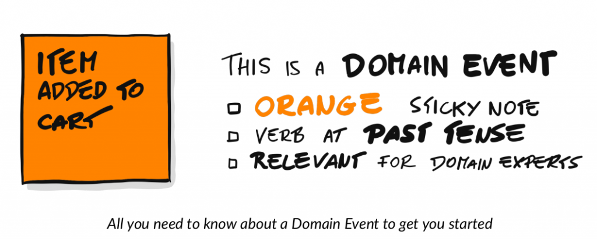
*Fonte: https://leanpub.com/introducing_eventstorming*

**Etapa 1: exploração caótica (*Chaotic Exploration*)**  
Peça que cada participante escreva individualmente os Eventos de Domínio que conhece. Nessa fase, todos devem trabalhar sozinhos para evitar que as percepções se influenciem. Procure também não responder perguntas nesse momento. Diga que os eventos podem ser colocados no papel da maneira que cada pessoa considerar correta: o objetivo é tornar visível a percepção de cada participante. Não apresse essa etapa, pois ela é uma parte essencial do EventStorming. Quando as pessoas começarem a posicionar seus eventos, poderão ler o que os demais escreveram, mas evite discussões em voz alta, pois elas podem influenciar ou apressar os outros participantes.

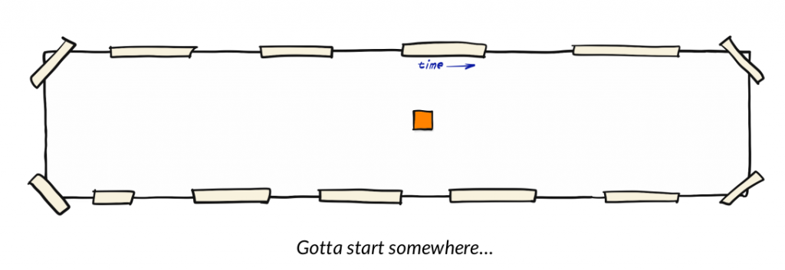
*Fonte: https://leanpub.com/introducing_eventstorming*

**Etapa 2: consolidar a linha do tempo (*Enforce the Timeline*)**  
Quando todos tiverem terminado de posicionar os Eventos de Domínio, inicie a consolidação da linha do tempo. Peça aos participantes que:

- discutam os eventos — espere bastante ruído e algum caos;
- removam eventos duplicados, discutindo se são realmente duplicados ou se a mesma linguagem está sendo usada para representar conceitos diferentes;
- organizem todos os eventos na sequência temporal correta;
- adicionem estrutura com fita adesiva quando necessário, tomando cuidado para não estruturar cedo demais e perder percepções valiosas.

**Etapa 3: pontos de atenção (*HotSpots*)**  
Durante a etapa anterior, surgirão conflitos entre diferentes percepções, o que é positivo: conflitos podem gerar aprendizado e novas descobertas. Para administrá-los, adicione um post-it rosado nos locais em que houver divergência. Esses pontos de atenção também podem representar dificuldades ou perguntas ainda sem resposta. Nessa fase, cabe ao facilitador adicioná-los.

**Etapa 4: adicionar conceitos quando necessário**  
Sempre que outro conceito do EventStorming surgir, adicione-o à legenda e apresente-o ao grupo. A imagem abaixo reúne os conceitos que explicam “quase” tudo o que pode ser acrescentado:

##### Check-out

Assim como começamos com um check-in, também encerramos o workshop com um *check-out*. Forme um círculo com todos e pergunte o que acharam do encontro. Uma pessoa pode entrar no círculo e fazer uma afirmação; quem concordar entra junto. Encerre quando tiver certeza de que todos terminaram.

Alberto Brandolini compara o EventStorming a uma pizza. O rolo de papel e os Eventos de Domínio são a base, a massa; os demais ingredientes podem ser adicionados da maneira que o grupo preferir — desde que não seja abacaxi 😉.

## Fontes

- [EventStorming.com](https://EventStorming.com)
- [Leanpub: Introducing EventStorming](https://leanpub.com/introducing_eventstorming)
- [Leanpub: DDD First 15 years](https://leanpub.com/ddd_first_15_years) — Discovering Bounded Contexts with EventStorming — Alberto Brandolini
- [Alberto Brandolini](https://twitter.com/ziobrando)

## EventStorming remoto

- [DDD Toolbox — Event Storming](https://dddtoolbox.com/event-storming) — coleção de ferramentas modernas e de código aberto executadas na Web, incluindo uma ferramenta de Event Storming ([código-fonte](https://github.com/poulainpi/ddd-toolbox)).

## Colaboradores

Agradecemos a todos os [colaboradores atuais e futuros](https://github.com/ddd-crew/eventstorming-glossary-cheat-sheet/graphs/contributors) e às seguintes pessoas, que contribuíram para o glossário e o guia de referência rápida do EventStorming:

- [Kenny Baas-Schwegler](https://github.com/baasie)
- [Chris Richardson](https://github.com/cer)

## Contribuições e feedback

O glossário e o guia de referência rápida do EventStorming estão disponíveis gratuitamente para uso. Comentários e ideias para aprimorar a técnica ou criar versões alternativas também são bem-vindos.

Em caso de dúvidas, entre em contato conosco ou abra uma [issue](https://github.com/ddd-crew/eventstorming-glossary-cheat-sheet/issues/new/choose).

Você também pode enviar um pull request com exemplos ou relatos de experiência.

[![CC BY 4.0][cc-by-shield]][cc-by]

Este trabalho está licenciado sob a [Licença Internacional Creative Commons Atribuição 4.0][cc-by].

[![CC BY 4.0][cc-by-image]][cc-by]

[cc-by]: http://creativecommons.org/licenses/by/4.0/
[cc-by-image]: https://i.creativecommons.org/l/by/4.0/88x31.png
[cc-by-shield]: https://img.shields.io/badge/License-CC%20BY%204.0-lightgrey.svg